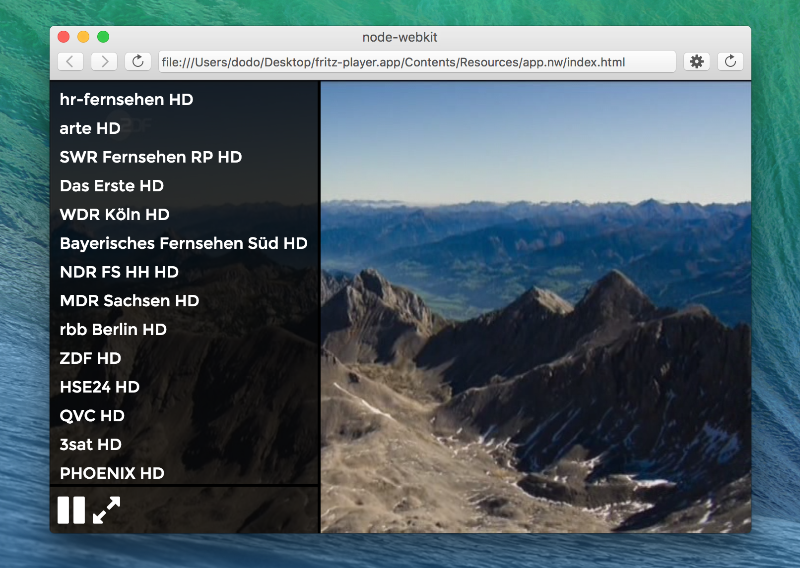

# fritz-player
>  :exclamation: Bis jetzt gerade so unter OSX benutzbar

Ein Live TV Player. Kann Streams anzeigen, welche  von libvlc verarbeitet werden können.
Erkennt eine `FRITZ!WLAN Repeater DVB-C` Box im Netzwerk und zeigt die verfügbaren Sender (inklusive HD) in der Seitenleiste an.

## Bedienung
* Maus an linker Fensterseite -> Seitenleiste erscheint
* Maus an rechter Fensterseite -> Seitenleiste verschwindet


## Screenshot



## Benutzen

### Quelltext
```
npm install
npm run build
npm start
```

### Binaries
* Unter Github [Release](https://github.com/freemountain/fritz-player/releases/tag/v0.0.1)
* OSX funktioniert
* Linux
  * libvlc muss vorhanden sein
  * startet, mehr wurde nicht getestet, da kein WebGL in VM
* Windows noch nicht unterstützt


## Release History
* 0.0.1 - init


## License
Licensed under the MIT license.
